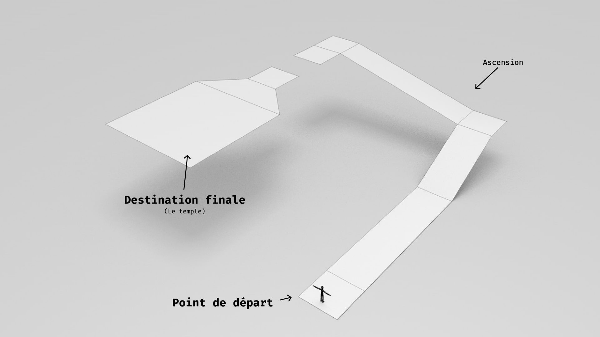

# Ex1 : Le Temple Dans La Forêt.

## Brief

Créez un environnement simple mettant en scène un chemin menant à un temple isolé.

## Contraintes : 
- Le parcours général doit respecter les volumes du mesh "Ex1-ForestTemple" (Work/jniac/Misc).
- L'étape finale du parcours est un "temple"
- Le sol est un "Landscape"
- Le matériau du sol contient au minimum 2 "layers" (ex 1. "Rock", 2. "Grass").
- 🗽 Le temple doit contenir une petite statuette en "or" (idole).

## Rendu :
[Coté "Unreal"](https://github.com/jniac/SDC_2223_B2_CMNPRJCT) :
- Un "level" (map) nommé XXX_EX1_YYYYY dans le dossier `Content/Work/ZZZ` où :
  - `XXX` est le préfixe en 3 lettres associés à chaque étudiant (et dérivé du pseudo github).
  - `YYY` une séquence de lettres sans importance (par exemple "MonJoliTemple").
  - `ZZZ` est le pseudo github (à la majuscule près).

[Coté "web"](https://github.com/jniac/SDC-22-23-B2-UE5) : 
- Une page web (ex: exercice1.html) dans le dossier `work/XXX` (où `XXX` est le 
  pseudo github). 
    - Cette page doit être accessible (lien) dans la page index.html 
    de chaque étudiant.
    - Les assets nécessaire (image, css) doivent être présents et correctement
    référencés.
    - Cette page web contient 4 captures d'écran: 
      - 1. Le point de départ.
      - 2. La vue depuis le saut avant le temple.
      - 3. Une vue qui vous plaira.
      - 4. Une vue de l'idole.

## Notions & connaissances abordées : 

- Éclairage / environnement (lighting / environment):
  - Sun (directional light)
  - Skylight (éclairer les zones à l'ombre)
  - "BP_SkySphere"
  - Build Light only (inutile sur PC/UE5?)

- Landscape
  - Sculpt
    - Smooth
    - Flatten
    - Ramp
  - Paint

- Landscape Material
  - LayerBlend (BluePrint)
  - LandscapeCoords (BluePrint)
  - LayerInfo: 
    - ajouter un layer (édition multiple)

- Matériau simple
  - Base color
  - Metalness / Roughness
  - Normal 
