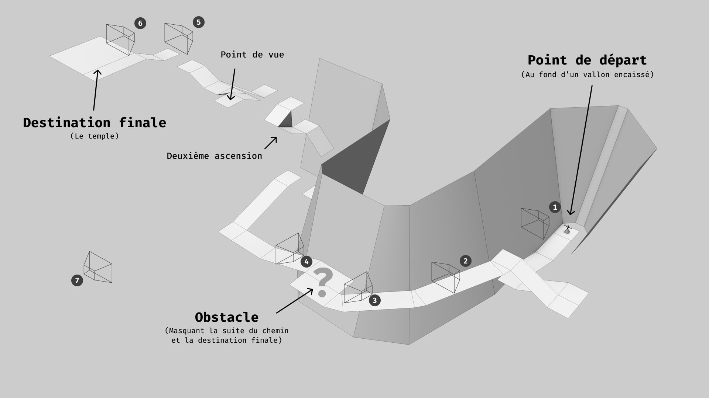

# Ex2: Le Temple Dans La Montagne

## Brief

Créez un environnement complexe mettant en scène un chemin menant à un temple isolé.
Le chemin est escarpé, la destination finale n'est pas immédiatement visible, 
certains passages nécessiteront d'être ajustés finement pour permettre le 
franchissement (saut hauteur / longueur).

Cet environnement sera complété dans un second temps par l'ajout d'un artefact 
(dans le temple), par la présence d'un léger sound design.

## Contraintes: 
- Le parcours général doit respecter les volumes du mesh "Ex1-ForestTemple" 
  (Work/jniac/Misc). Les volumes peuvent être ainsi résumés : 
    - Le joueur commence dans un vallon étroit, encaissé, la montagne le surplombe, 
    il faut lever la tête pour voir le ciel. 
    - Une fois sorti du premier lieu, le joueur progress à flanc de montagne, le 
    paysage est dégagé sur sa gauche.
    - Un obstacle se présente sur le chemin, masquant la suite du parcours.
    - L'obstacle franchit une ascension difficile survient alors,
    - Au terme de laquelle se trouve le temple.
- L'étape finale du parcours est un "temple"
- Une étape intermédiaire présente une obstacle dont le franchissement qui aboutit 
  à la révélation de la destination ultime (le temple).
- Le sol est un "Landscape"
- Le matériau du sol contient au minimum 3 "layers" (ex 1. "Rock", 2. "Grass", 3. "Dirt").
- L'environnement apparaît riche et détaillé grâce à l'utilisation de "Foliage" 
  (végétation, petits rochers).
- L'horizon est cohérent tout au long du parcours (il n'y a pas de gros "trous").
